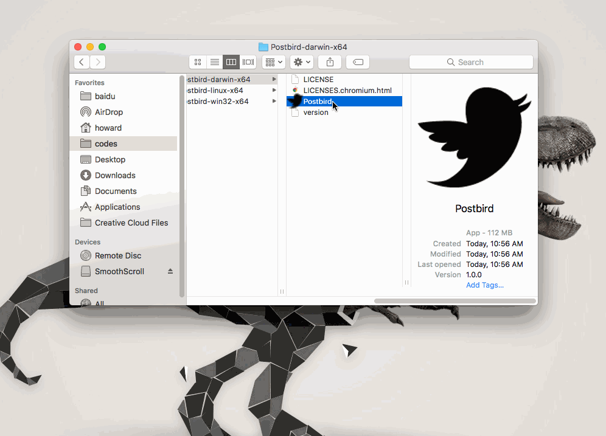

post-bird
====================


![][david-url]

`post-bird` is a plus version of postman. We believe `Postman` lack of few functions which are required by QAs, that's why we build `post-bird`





# Download(not provided now) ##

* Windows: [64bit](https://github.com/leftstick/post-bird/releases/download/1.0.0/hosthigh-1.0.0-win64.zip)
* Mac 11.11+: [64bit](https://github.com/leftstick/post-bird/releases/download/1.0.0/hosthigh-1.0.0-darwin.zip)
* Linux: [64bit](https://github.com/leftstick/post-bird/releases/download/1.0.0/hosthigh-1.0.0-linux.zip)


## How To Contribute ##

>clone repo first

```bash
npm install
npm start
```

>once code changed, it shall be reloaded automatically, or you may can reload it manually with `ctrl/cmd + shift + r`.


## LICENSE ##

[GPL v3 License](https://raw.githubusercontent.com/leftstick/post-bird/master/LICENSE)
[david-url]: https://david-dm.org/leftstick/post-bird.png